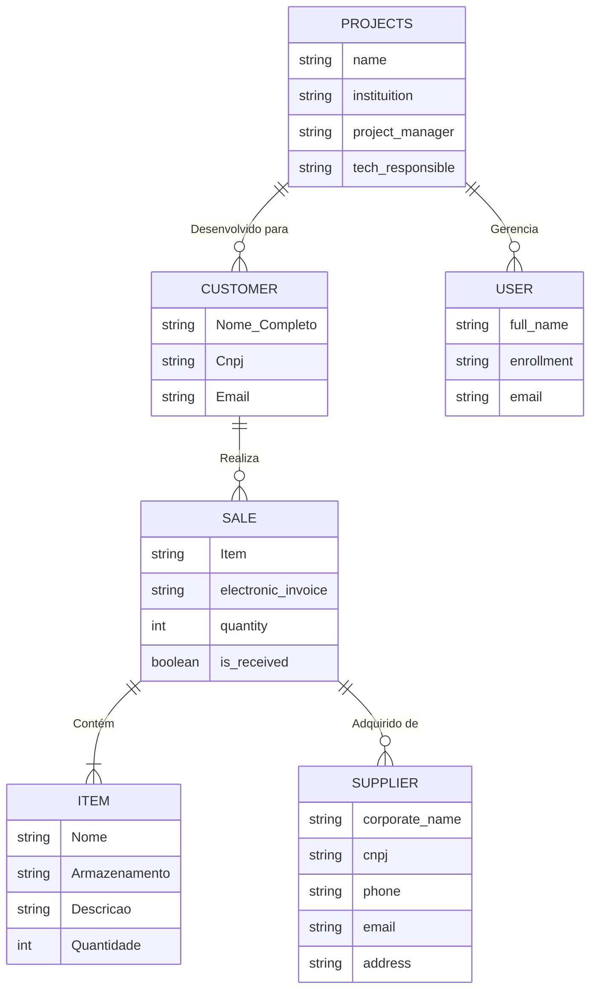

### Gestão de Estoque

### Descrição

Este projeto foi desenvolvido como parte do curso de **Análise e Desenvolvimento de Sistemas (ADS)**, durante a **quarta fase** da faculdade. O objetivo principal é criar uma solução de gestão de estoque eficiente, permitindo o controle e monitoramento de produtos através de seu respectivo projeto.

## Funcionalidades

- **Gerenciamento de Usuários (Funcionários):** Registrar, visualizar, deletar e editar todos os funcionários da empresa, permitindo a gestão de suas funções em cada projeto.
- **Projetos:** Criar e gerenciar projetos, vinculando funcionários e produtos, permitindo a organização e execução das tarefas de acordo com a necessidade de cada projeto.
- **Compra:** Registrar e gerenciar compras de produtos, acompanhando o histórico de aquisições e integrando com o estoque automaticamente.
- **Item:** Gerenciar os itens do estoque, com controle preciso de suas características como quantidade, localização e movimentações.
- **Cliente:** Registrar e gerenciar os dados dos clientes, facilitando o controle de pedidos e personalizações de acordo com suas demandas.
- **Fornecedor:** Cadastrar e gerenciar fornecedores, garantindo que todas as transações e aquisições sejam documentadas e rastreáveis.

### Diagrama Entidades do Sistema de Gestão de Estoque

### Tecnologias Utilizadas

- **Frontend:** TypeScript, Next.js, Node.js, React.
- **Backend:** GoLang, ServiceWeaver, SQLC, Fiber e Boneless.
- **Banco de Dados:** MySQL e AWS S3
- **Outros:** Docker Compose

### Colaboradores

  

    <a href="https://github.com/Ssalvador221">
      
       João Salvador
    </a>
  

  

    <a href="https://github.com/matiasgonzalvez">
      
       Matias Gonzalvez
    </a>
  

  

    <a href="https://github.com/JFP79">
      
       Jael Felipe
    </a>
  

  

    <a href="https://github.com/felipeloche">
      
       Felipe Loche
    </a>
  

